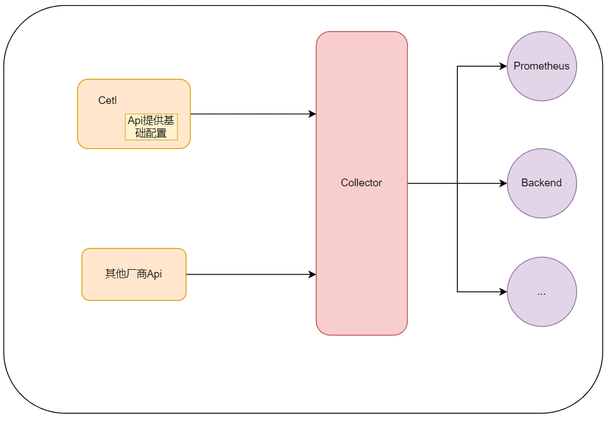
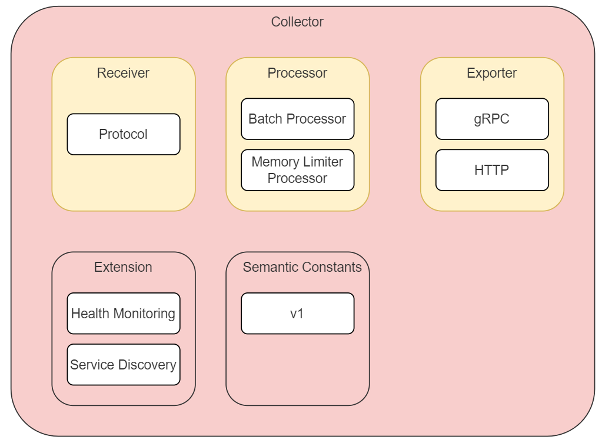
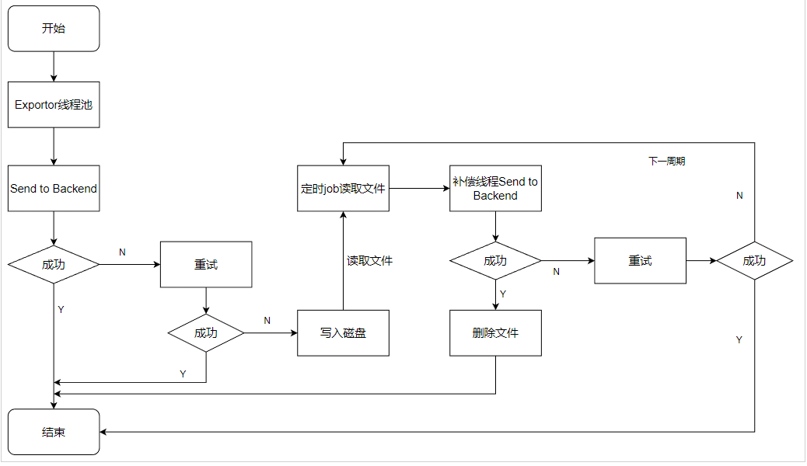
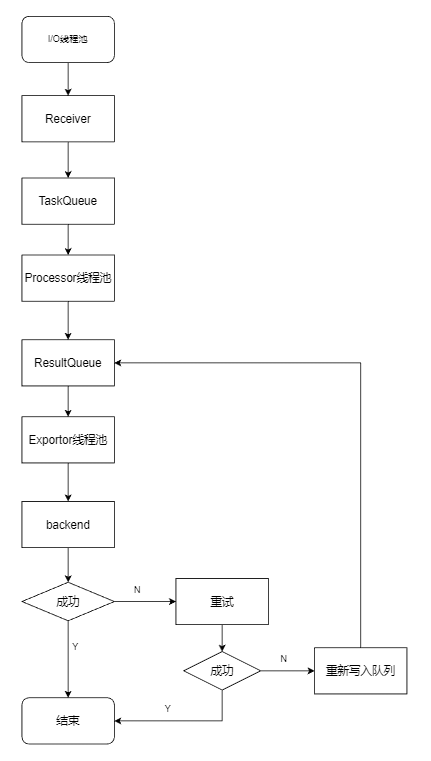

# OpenRUM-collector
## 一、整体架构图
Collector负责接收，处理和导出监测数据，包含的核心组件：

1.Receiver

2.Processor

3.Exporter

核心组件支持自定义

## 二、组件职责：

### 1.Receiver
接收标准OpenRUM协议，服务鉴权与数据过滤，目的为过滤恶意和无用请求 。例如http+json格式

**服务鉴权**：使用springboot+JWT

**数据过滤**：请求携带header,解析header中必要参数来过滤恶意请求

**内存限制**：内存限制器处理器允许对内存执行定期检查。如果内存超出定义的限制，将开始丢弃数据并强制GC减少内存消耗。

### 2.Processor
负责做监测数据加工处理，如丢弃数据，增加信息，异常数据过滤，转批处理等，并把数据传递给下一个Processor或者传递给一个或多个Exporter。包含批处理器和内存限制处理器。

**Batch Processor** : 为了缓解对于下游服务的压力，processor处理完之后的数据，不会立刻发送到下游，而是先放到内存的消息队列ResultQueue，启动线程轮询如果达到设定的时间间隔或者到达设定的批量发送队列大小时
，提交任务到Exporter Thread Pool 发送到下游backend;

### 3.Exporter
负责将 Processors 后的数据导出到特定的后端，比如存储到 Prometheus 中
### 4.Extension:

打印服务健康监测日志；

**nacos**：实现服务发现

### 5.Semantic Constants

各版本的语义常量

> [v1版本语义](https://github.com/RealUserMonitoring/OpenRUM-specification)

以后语义更新，增加v2版本语义快链及语义改变内容

## 三、可靠性保证设计

**优雅退出**：当正常通知程序退出时,程序会将内存中的数据处理完成后再退出，这主要包括：

内存中线程池中正在执行的线程执行结束；

内存队列中的数据全部序列化到磁盘上；

**存储分级**：内存、磁盘、消息中间件

如果配置了MQ则保存到MQ，processor消费MQ中的数据进行后续处理；

如果未配置MQ则使用内存和磁盘，消息接收后保存到内存队列，若导出失败写入本地磁盘，定时job读取文件后，发送成功删除文件否则下个周期尝试发送。

### 1.内存加磁盘处理流程:

### 2.线程模型

**Receiver**：用中间件创造的线程控制

**Processor线程池**：用于处理和过滤请求数据，把处理完的数据增加到ResultQueue

**Exporter线程池**：用于处理内存队列中的数据导出

**quartz线程池**：处理定时任务

## 四、数据流向图

### 启动容器命令:

- eg:

`docker run -p 8890:8890 --env NACOS_SERVER=127.0.0.1:8848 --env NAMESPACE=dev --name openrum-collector tag`